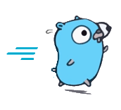
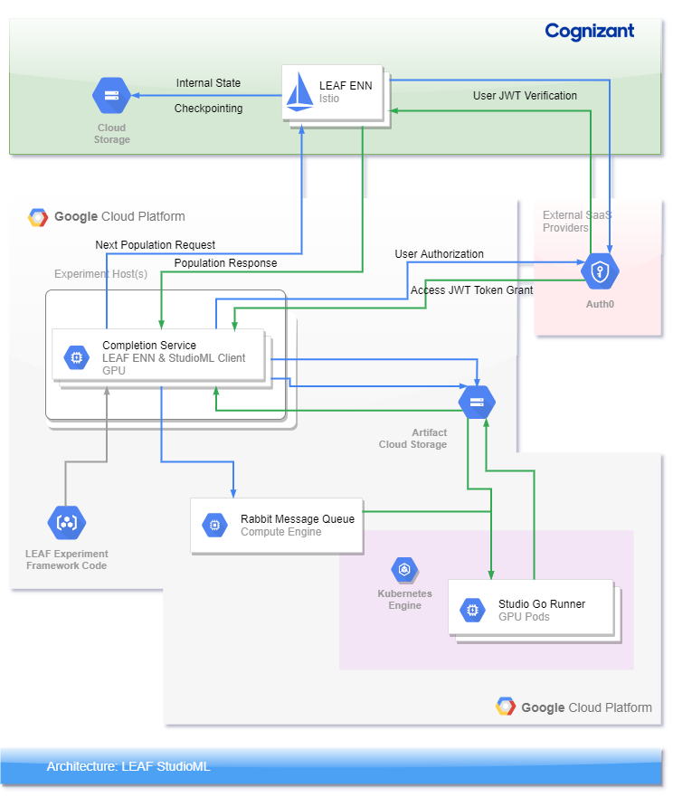
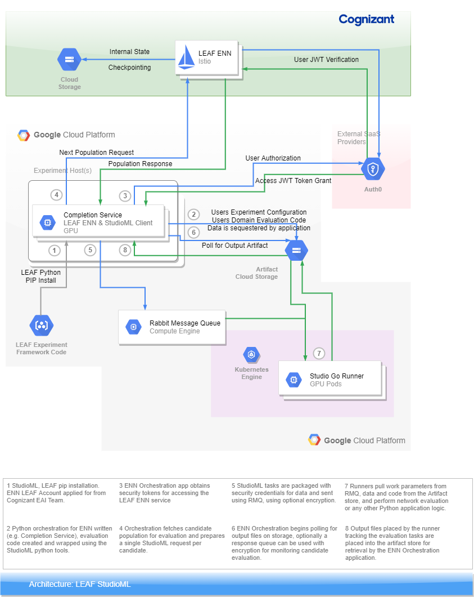
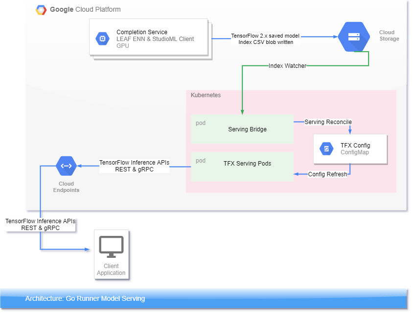

= StudioML distributed evaluation and model serving
ifdef::env-github[]
:imagesdir:
https://raw.githubusercontent.com/leaf-ai/studio-go-runner/main/docs/artwork
:tip-caption: :bulb:
:note-caption: :information_source:
:important-caption: :heavy_exclamation_mark:
:caution-caption: :fire:
:warning-caption: :warning:
endif::[]
ifndef::env-github[]
:imagesdir: ./
endif::[]
:toc:
:toc-placement!:

This document discusses the core components within the StudioML eco-system, the role of the Go Runner, all with a summary deployment guide.

This document makes reference to the LEAF™ AI framework which is a commercial proprietary offering from the Cognizant Evolutionary AI™ team.  While this document describes a proprietary application of the Open Source StudioML solution the deployment detailed within this document can also be leveraged by Open Source solutions that choose not to make use of LEAF™.

toc::[]

== StudioML

The StudioML eco-system was conceived to meet the need for an automatted method for producing AI/ML models in large numbers and performing evaluations of models and evolving new models in response to previous evaluations.

Existing solutions for creating and training models focus on a manual intensively curated process.  StudioML was born out of a need to reduce the operational noise of doing large scale model selection and popluation based training approaches to AI/ML.

Evolutionary AI™ leverages components that are proprietary and hosted by the Evolution service, and also components that are under the control of the experiment and can often access data that is sensitive and requires privacy.

== Background

Initially the StudioML offering was solely focused on a Python job distribution tool that had both a python client and a bundled python worker that would execute python code on behalf of the client.

As researchers began to make use of StudioML for job distribution the needs for very large numbers of Neural Network evaluations to be performed and this project, the Studio Go Runner was created.

The Studio Go Runner, or runner, was designed to meet the goals of our research teams performing original research and larger commercial clients.  The architecture and deployment model for the runner and the LEAF offerings leads to an environment that uses two major components one being the model training and creation and the second being model serving.

It is recommended that when deploying these two they be done using seperate Kubernetes clusters.  The demarcation between the two being a bucket within Google Cloud Storage.  The StudioML eco-system uses the S3V1 APIs to access storage giving it a wide range of deployment options including cloud and on-premises.

== Model Creation

Model creation and publishing for serving within StudioML is orchestrated using a user created application.  The LEAF ENN framework offers a Python library for orchestrating the retrieval of candidate models for training and evaluation from the LEAF ENN Cognizant hosted server.  Other orchestration applications have been written directly against the message queue and artifact storage in languages such as Swift and Go.

The StudioML model training pipeline is focused on evaluation of large numbers of models most of which are short-lived.  Because of the scale out requirements StudioML uses message queues to dispatch work within one or more compute clusters.  Message queues offer an ability for tasks packaged as messages to be pulled by runners and for runners that have claimed tasks to have their tasks recovered and messages placed back into the queue should they fail.

StudioML also makes use of cloud storage for persistence of models, and training artifacts for experiments.  Code is also versioned using git.  Data versioning is handled using artifacts associated with tasks.  Artifacts act as descriptors of data, code, and digital information generally that is leveraged during training.  Artifacts persisted using S3 can also be annotated using S3 metadata.

To the task queue, and the storage layer the Kubernetes based compute runners are added as clients.  Runners unpack the task definitions pulled from the task queue and use bundled credentials and artifact descriptions to access data.  Encryption is supported for the task queue messages with Kubernetes secrets being used to handled per queue level secrets used during decryption.

Orchestration is implemented using general purpose programming languages rather than as a graph or using Domain Specific Languages.  The reason for this is because of the varied styles of AI/ML workflows that need to be accommodated.  In the case of evolutionary AI approaches, orchestration involves retriving a number of candidate neural networks from the ENN service, using OAuth credentials, and then posting tasks to a message queue.  As results of the dispatched candidate training and evaluation arrive the orchestration code makes decisions ias to where to stop the ongoing training using the numbers of successfully returned results and the elapsed time training is taking.  When the orchestrator is satisfied with the number of returned candidate fitness scores then the scores are sent back to the LEAF ENN service and new candidates are returned to the orchestration application.  Each turn of the fitness scores being returned is a generation for ENN purposes.  Orchestration logic is responsible for determining when the candidate networks have begun to converge on a good-enough score, as defined by the application domain, then the entire experiment is stopped and the winning candidate can then be either posted for serving or marked for further use by the experimenter.

== Model Serving

The serving system is further documented in a runner application note found at, docs/app-note/model-serving.md.

